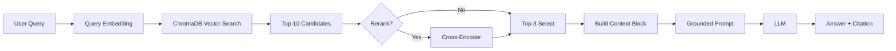

# Architecture — RAG Pipeline (Day 08 Lab)

> Template: Điền vào các mục này khi hoàn thành từng sprint.
> Deliverable của Documentation Owner.

## 1. Tổng quan kiến trúc

```
[Raw Docs]
    ↓
[index.py: Preprocess → Chunk → Embed → Store]
    ↓
[ChromaDB Vector Store]
    ↓
[rag_answer.py: Query → Retrieve → Rerank → Generate]
    ↓
[Grounded Answer + Citation]
```

**Mô tả ngắn gọn:**
> Chatbot RAG giúp nhân viên công ty trả lời câu hỏi liên quan đến chính sách, quy trình dựa trên tài liệu nội bộ. Hệ thống gồm pipeline indexing để xử lý tài liệu và pipeline retrieval để tìm kiếm và tạo câu trả lời có trích dẫn nguồn.

---

## 2. Indexing Pipeline (Sprint 1)

### Tài liệu được index
| File | Nguồn | Department | Số chunk |
|------|-------|-----------|---------|
| `policy_refund_v4.txt` | policy/refund-v4.pdf | CS | 6 |
| `sla_p1_2026.txt` | support/sla-p1-2026.pdf | IT | 5 |
| `access_control_sop.txt` | it/access-control-sop.md | IT Security | 8 |
| `it_helpdesk_faq.txt` | support/helpdesk-faq.md | IT | 6 |
| `hr_leave_policy.txt` | hr/leave-policy-2026.pdf | HR | 5 |

### Quyết định chunking
| Tham số | Giá trị | Lý do |
|---------|---------|-------|
| Chunk size | 400 | Để đảm bảo mỗi chunk chứa đủ thông tin nhưng không quá dài |
| Overlap | 80 | Để giữ lại thông tin liên quan giữa các chunk |
| Chunking strategy | Heading-based | Tài liệu có cấu trúc rõ ràng, chia section cụ thể |
| Metadata fields | source, section, effective_date, department, access | Phục vụ filter, freshness, citation |

### Embedding model
- **Model**: OpenAI text-embedding-3-small
- **Vector store**: ChromaDB (PersistentClient)
- **Similarity metric**: Cosine

---

## 3. Retrieval Pipeline (Sprint 2 + 3)

### Baseline (Sprint 2)
| Tham số | Giá trị |
|---------|---------|
| Strategy | Dense (embedding similarity) |
| Top-k search | 10 |
| Top-k select | 3 |
| Rerank | Không |

### Variant (Sprint 3)
| Tham số | Giá trị | Thay đổi so với baseline |
|---------|---------|------------------------|
| Strategy | hybrid | Kết hợp dense và sparse sử dụng thuật toán RRF |
| Top-k search | 10 | Không đổi |
| Top-k select | 3 | Không đổi |
| Rerank | cross-encoder | Sử dụng mô hình Cross-encoder (ms-marco-MiniLM-L-6-v2) để chấm điểm lại top 10 trước khi lọc ra top 3. |
| Query transform | Không | Không đổi (Tập trung tối ưu Retriever và Reranker trong Sprint này). |

**Lý do chọn variant này:**
> TODO: Giải thích tại sao chọn biến này để tune.
> Ví dụ: "Chọn hybrid vì corpus có cả câu tự nhiên (policy) lẫn mã lỗi và tên chuyên ngành (SLA ticket P1, ERR-403)."
> Chọn Hybrid Search (Dense + Sparse) vì tài liệu nội bộ chứa đựng ngôn ngữ tự nhiên lẫn các thuật ngữ chuyên môn. Dense Retrieval giúp bắt được ngữ nghĩa, trong khi Sparse Retrieval (BM25) có thể bắt được các keyword quan trọng mà embedding có thể bỏ qua. Reranking bằng Cross-encoder giúp cải thiện độ chính xác của kết quả cuối cùng bằng cách đánh giá lại mức độ liên quan của từng candidate dựa trên query cụ thể.

> Bổ sung Cross-encoder vào pipeline giúp tăng khả năng phân biệt giữa các candidate có điểm embedding tương tự nhưng mức độ liên quan khác nhau. Điều này đặc biệt hữu ích khi top-k search trả về nhiều candidate có điểm số gần nhau, giúp cải thiện chất lượng câu trả lời cuối cùng.
---

## 4. Generation (Sprint 2)

### Grounded Prompt Template
```
Answer only from the retrieved context below.
If the context is insufficient, say you do not know.
Cite the source field when possible.
Keep your answer short, clear, and factual.

Question: {query}

Context:
[1] {source} | {section} | score={score}
{chunk_text}

[2] ...

Answer:
```

### LLM Configuration
| Tham số | Giá trị |
|---------|---------|
| Model | gpt-4o-mini |
| Temperature | 0 |
| Max tokens | 512 |

---

## 5. Failure Mode Checklist

> Dùng khi debug — kiểm tra lần lượt: index → retrieval → generation

| Failure Mode | Triệu chứng | Cách kiểm tra |
|-------------|-------------|---------------|
| Index lỗi | Retrieve về docs cũ / sai version | `inspect_metadata_coverage()` trong index.py |
| Chunking tệ | Chunk cắt giữa điều khoản | `list_chunks()` và đọc text preview |
| Retrieval lỗi | Không tìm được expected source | `score_context_recall()` trong eval.py |
| Generation lỗi | Answer không grounded / bịa | `score_faithfulness()` trong eval.py |
| Token overload | Context quá dài → lost in the middle | Kiểm tra độ dài context_block |

---

## 6. Diagram (tùy chọn)

> TODO: Vẽ sơ đồ pipeline nếu có thời gian. Có thể dùng Mermaid hoặc drawio.


